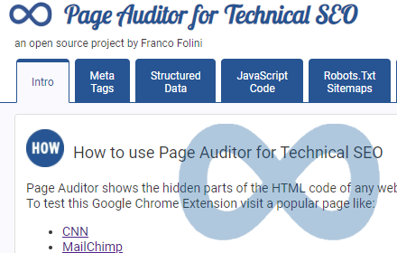
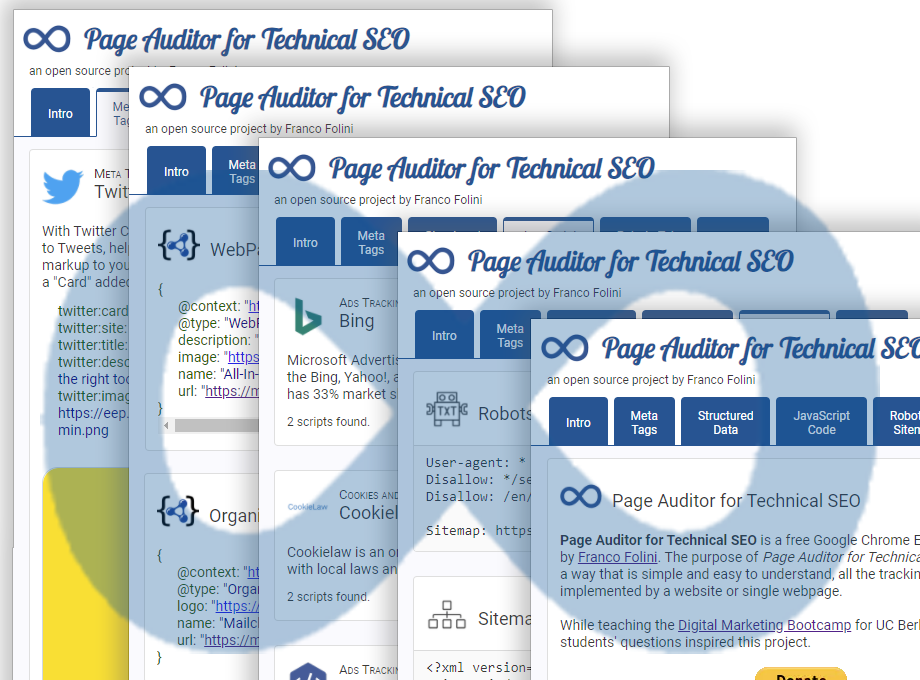
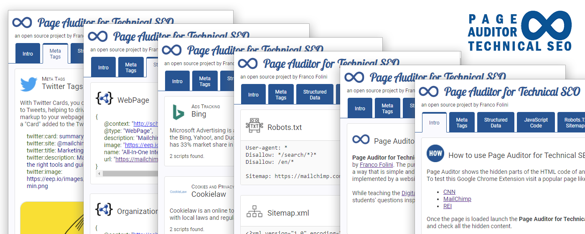
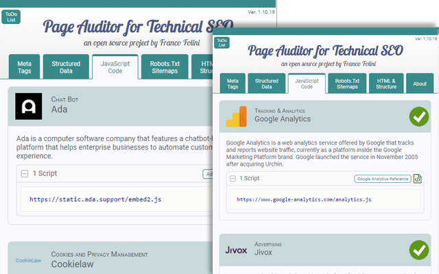
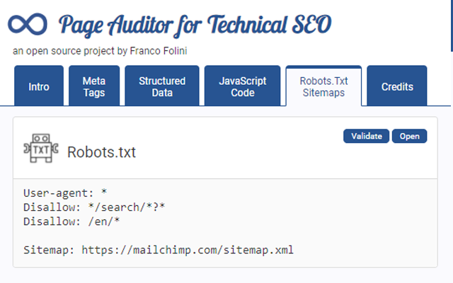

# Google Web Store Creative 

## Description (plain text)
A free and open-source Google Chrome Extension to analyze the elements of a web page that can have an impact on the page speed and SEO. The "Page Auditor for Technical SEO" is a tool you need to perform a Technical SEO Audit of any web page. Page-Auditor will checks and displays, in a human readable format, all the hidden information from a web page, including: 

* Structured Data inside the page

* Tracking JavaScript code with explanation of the tracking and links to the tracking company

* Meta Tags grouped by category with detailed description, explanations, and links to technical documentation.

* Robots.txt and Sitemap.xml

## Graphic Assets

Store icon - 128x128 pixels

||
-
---
Small promo tile - 440x280 pixels

||
-
---
Large promo tile - 920x680 pixels

||
-
---
Marquee promo tile - 1400x560 pixels

||
-
---
Screenshot 1 640x400 pixels

|
-
---
Screenshot 2 640x400 pixels

||
-
---
Screenshot 3 640x400 pixels

||
-
---
Screenshot 4 640x400 pixels

||
-
---
Screenshot 5 640x400 pixels

||
-
