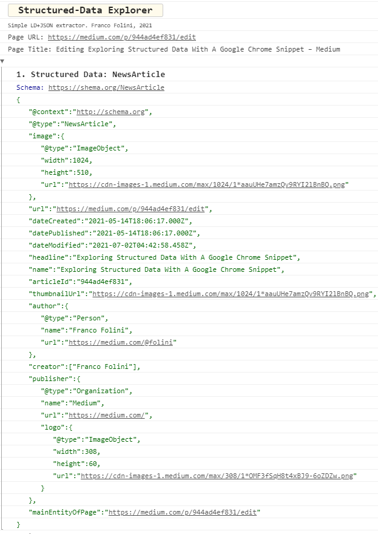

# SD-Explorer
> Structured Data Explorer. A code snippet to add to your Google Chrome browser.

# Purpose
Exploring the Structured Data included in web page can be challenging for people without a technical background. Structured Data is very important for SEO, and we need an easy way to look at the Structured Data of any web pages.

To look at the Structured Data we need to scan the HTML source code of the page and locate the specific `<script>` tags that contain the structured data. Then we have to look inside the tag and try to figure out the meaning of the JSON code. Many times the JSON code has been compressed making it unreadable for humans. The only way to make the Structured Data readable would be to copy the JSON code from the page and paste it in an online _JSON Formatter_.

To make this exploration a little bit easier and simpler for non technical people, I created this small _Google Chrome Snippet_ that can easily be added to any Google Chrome and used on any webpage. The snippet will automatically locate the Structured Data and will present it in a nicely formatted way.

## License
This code snippet is released under [__BSD-3-Clause__](./LICENSE.md) license.

## Deploy the Snippet
1. Open the Google Chrome DevTools. The are several ways, and the simplest is to use a keyboard shortcut from any webpage: on Windows, press `F12` or `CTRL+SHIFT+I`, on a Mac, press `Command+Option+I`.

2. Go to the Source tab of the DevTools. If you don't see the _Source_ tab, select the right-pointing arrows at the right extreme of the menu bar.

3. On the Source bar (at the top of the Source area), select the _Snippet_ item. If you don't see the _Snippets_ label in the menu bar, select the right-pointing arrows on the right

4. Select the _+ new Snippet_ command just below the bar to create a new snippet

5. Copy the JavaScript code from [`./src/snipper.js`](./src/snipper.js) and paste it on the area code on the right side of your DevTools panel. Save the snipper using `CTRL+S` (on Windows) or `Command+S` (on Mac).

6. Right-click on the snippet name and select the _Rename_ command. I suggest naming the snippet _getStructuredData_ as in the image below, but the name is not so important.

## Execute the Snippet
1. Open the Google Chrome DevTools. The are several ways, and the simplest is to use a keyboard shortcut from any webpage: on Windows, press `F12` or `CTRL+SHIFT+I`, on a Mac, press `Command+Option+I`.

2. Go to the Source tab of the DevTools. If you don't see the Source tab select the right-pointing arrows at the right extreme of the menu bar

3. Right-click on the snippet name that you intend to run and select `Run`. Another way to run your snippet is to place the cursor over the snippet editor and then press `CTRL+Enter` if you are on Windows or `Command+Enter` if you are on a Mac.

## Roadmap
- [x] Porting the snippet from JavScript to TypeScript
- [ ] Transform the snippet into a regular Google Chrome Extension
- [ ] Add more SEO features, like highlighting of images missing the `alt` attribute

---
Copyright (c) 2021, Franco Folini
All rights reserved.
