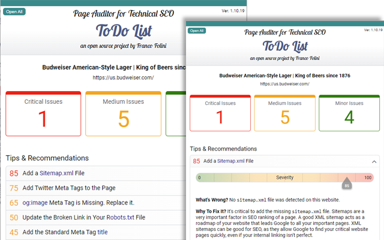
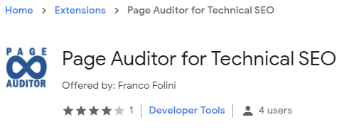

# Page Auditor for Technical SEO

**Page Auditor for Technical SEO** is an open source free_Google Chrome Extension_ created by [Franco Folini](https://www.linkedin.com/in/francofolini/) to explore and analyze the main on-page technical SEO features of any web page.

# Purpose

**Page Auditor** is a free _Microsoft Edge_ and _Google Chrome_ Extension based on open source code. It can be installed on any Microsoft Edge or Google Chrome browser and used to explore and audit the content of any webpage. The goal is to make the _On-Page Technical SEO Analysis_ an effective and easy tool for everybody, and in particular for non technical people.

Performing a _On-Page Technical SEO Analysis_ requires analyzing several (almost) hidden elements of an HTML page, including Meta Tags, Structured Data, JavaScrips, `Robots.txt` and `Sitemap.xml` files. It can be a challenging task, in particular for people without a strong technical background. Many of these elements are important for the page SEO performance. **Page Auditor** makes it easy to check all these elements. It can be used to analyze our own web pages, as well as our competitors' pages.

**Page Auditor** automatically scans the HTML code of the selected page to locate specific HTML elements, like `<script>` and `<meta>` tag elements. Then it extracts the relevant content and attributes of each tag and classifies them according to manually-curated internal lists of categories. The result of the analysis is then presented to the user in clear, well formatted, human readable reports. Compared to a manual analysis of the same page, the benefits are evident. For example, the JSON-LD and the JavaScript code included in a page provide critical information about the page, but they are frequently compressed and almost unreadable for humans. In fact they are intended to provide information to the browser and to the search engin crawlers visiting the page.**Page Auditor** takes care of making this information accessible by properly formatting the code and the content of these items and providing detailed information about the meaning and use of each one ofg them.

## Features

| Structured Data Report
| -
|

| JavaScript Code Report (Tracking, Analytics, Ads)
| -
||

| Meta Tags Report
| -
||

| Robots.txt & Sitemap.xml Report
| -
||

| HTML Report
| -
||

| To-Do Report
| -
||

## License

This _Google Chrome Extension_ is open source and it is released under [__BSD-3-Clause__](./LICENSE.md) license.

## Running the Live Version

Testing the live version of **Page Auditor**, the version publicly available on the _Microsoft Edge Add-ons Store_ and on the _Google Chrome Web Store_, is very simple. Visit the [*Page Auditor for Edge* page](https://microsoftedge.microsoft.com/addons/Microsoft-Edge-Extensions-Home) on Edge Add-ons or the [*Page Auditor for Chrome* page](https://chrome.google.com/webstore/detail/page-auditor-for-technica/dogloealpnibhaieipodofhcbamacabh) on Google Chrome Store and follow the instructions to start the installation.
Once you installed the extension, visit a web page you would like to analyze and start the extension from the *Extensions Menu* on the top right corner of your browser.

| _Page Auditor_ on Microsoft Edge Add-ons Store and Google Chrome Web Store |
| -- |
||

## Testing a New Version on Chrome

This is how to test the Extension or any variation opf it on your _Google Chrome Web Store_ (the process for Microsoft Edge is similar):

1. Make sure the file [`package.json`](package.json) define the build target as "Chrome". Line of the file should be:
`"target": "Chrome",` if you are building for Chrome, and `"target": "Edge",` if you are building for Edge.
1. Generate a new build with the command `npm run build`
1. Open the _Google Chrome Extensions_ page on your browser by entering the following URL: [`chrome://extensions/`](chrome://extensions/)
1. Select the [*Load Unpacked*] button on the top left corner of the page.
1. When the [*Select Folder*] panel opens, navigate your computer file system and select the `/dist` folder of the extension.
1. Now you can run your local copy of the extension by clicking on the extension icon on the top right corner of your Google Chrome browser. If you don't see the Extensions logo on the browser corner, select the _extensions_ icon and pin the _PageAuditor_ extension to the main toolbar.
1. To test new changes (fresh files are in the `./dist` folder) click the refresh icon on the Extension box in the same [`chrome://extensions/`](chrome://extensions/) page.

## Testing the Code

There is a battery of tests implemented with [`jest`](https://jestjs.io/). At the moment, September 2021, the tests are covering 100% of Statements and Functions.

| File                    | % Stmts | % Branch | % Funcs | % Lines | Uncovered Line #s
|-------------------------|---------|----------|---------|---------|-------------------
| All files               |     100 |    96.02 |     100 |     100 |
|  src                    |     100 |      100 |     100 |     100 |
|  - card.ts              |     100 |      100 |     100 |     100 |
|  src/sections           |     100 |    95.98 |     100 |     100 |
|  - credits.ts           |     100 |      100 |     100 |     100 |
|  - intro.ts             |     100 |      100 |     100 |     100 |
|  - ld-json-functions.ts |     100 |    84.21 |     100 |     100 | 33-60
|  - ld-json.ts           |     100 |      100 |     100 |     100 |
|  - meta-functions.ts    |     100 |     98.1 |     100 |     100 | 61,93
|  - meta.ts              |     100 |    94.74 |     100 |     100 | 28-33
|  - robots-functions.ts  |     100 |      100 |     100 |     100 |
|  - robots.ts            |     100 |      100 |     100 |     100 |

Run `npm run test-coverage` to generate the tests coverage report.
The report will be available at [`coverage/lcov-report/index.html`](coverage/lcov-report/index.html)

## Formatting the Code

To format the code with [Prettier](https://prettier.io/) run `npm run format`.

## Additional Information

* This extension is based on a Google Chrome Snippet I described in an article I published on Medium on May 14, 2021. The article's title is [Exploring Structured Data With A Google Chrome Snippet](https://folini.medium.com/exploring-structured-data-with-a-google-chrome-snippet-944ad4ef831). Since the initial idea and implementation the extension has been growing significantly including more analysis and brand new reports.

* On September 16, 2021 I published an article on Medium for a non-technical audience describing the features and the usage of the _Page Auditor_ Chrome Extension. The article's title is [I wrote a Chrome Extension to perform on-page SEO analysis](https://folini.medium.com/i-wrote-a-chrome-extension-to-perform-on-page-seo-analysis-d680f6713707).

All information and creative required to publish the Google Chrome eExtension are available on the folder [Google Web Store creative material](./GoogleWebStore.md).

## Roadmap

- [x] Porting the snippet from JavaScript to TypeScript
* [x] Transform the Google Chrome Snippet into a regular Google Chrome Extension
* [x] Porting the Extension to the Microsoft Edge browser / platform
* [x] Highlighting of images missing the `alt` attribute or failing download
* [ ] Reorganize the user interface with a summary and links to each section. No more tabs.
* [ ] Add more SEO features, like

---
Copyright (c) 2021, Franco Folini
All rights reserved.
